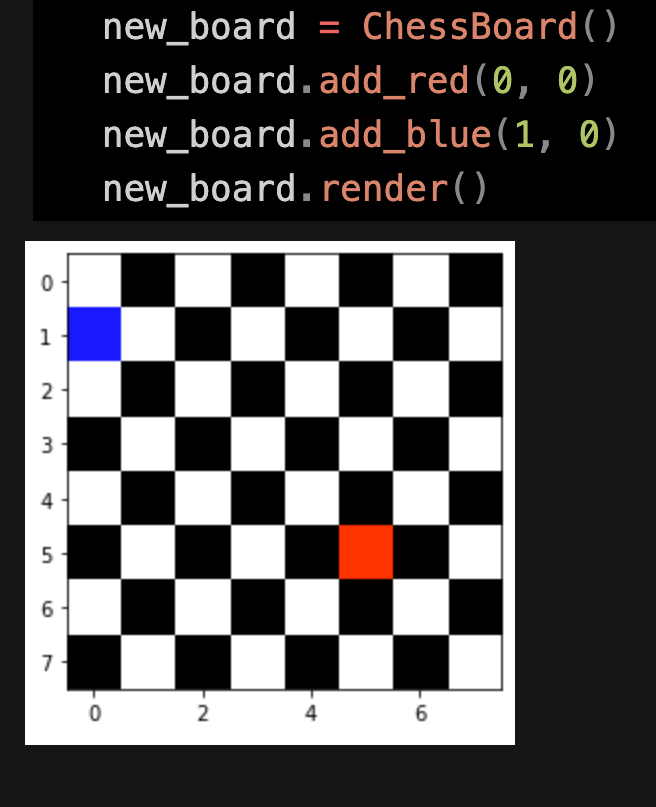

## Numpy Arrays

Lab - 11

_Author: Leo Kukharau_

---

## Description

- Define a `ChessBoard` class:
  - should have add_red method that accepts a row and column as input;
  - should have add_blue method that accepts a row and column as input;
  - should have render method that displays the chess board on screen with red and blue shown in correct locations;
  - should have is_under_attack method that return boolean if red is under attack by a blue piece horizontally, vertically or diagonally.

---

### Getting Started

Clone this repository to your local machine.

```
$ git clone https://github.com/LeoKuhorev/chess-board.git
```

### To run the program from VS Code:

Select `File` -> `Open` -> `Project/Solution`

Next navigate to the location you cloned the Repository.

Double click on the `chess-board` directory.

Then select and open `chess_board.ipynb`

---

### Visuals

#### Building a board and adding queens



---

### Change Log

1.0: _Added basic functionality_ - 01 Jul 2020

---

Link to PR: https://github.com/LeoKuhorev/chess-board/pull/2
